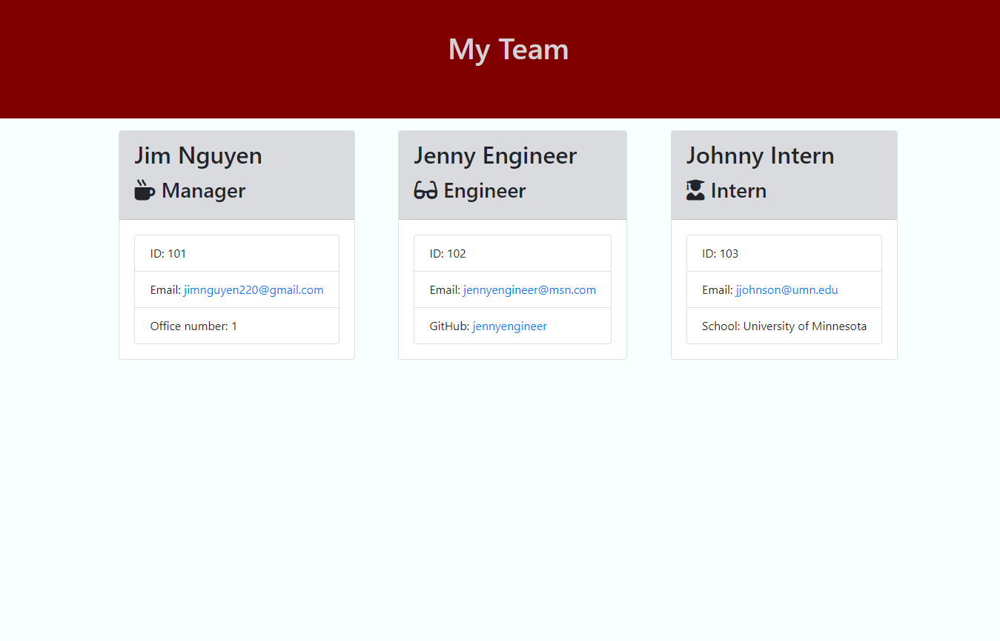

# TEAM-GENERATOR
  
  ## Description
  
  Using Node, answering a series of questions that displays name and contact information for members of a software engineering team.  This project will also include tests, that also work and are ran using npm tests.
  
  A sample of the questions is provided here - 

  

  After the questions are answered, the answers are then dynamically loaded onto an html page. 

  

  
----------------------------------------

## Youtube

**If you would like to see the app in action -** 

  [Youtube](https://youtu.be/ZYsN27kz5hE)

  
  
------------------------------------
  
  ## Installation
  
  To install this application, you will need to enter the following line of code into a Node.js session to download dependencies required to make app run. 
      
    npm install
  
  
  ------------------------------------
  
  ## Usage
  
To start the app, enter the folllowing in the command line, an example is provided below.
      
    node app

Will also be using inquirer, path, and classes to define employees.  Some links to some additional resources I used to complete this project is below.

[Node inquirer Docs](https://www.npmjs.com/package/inquirer#prompt) 

[Stack Overflow - How to validate email address](https://stackoverflow.com/questions/65189877/how-can-i-validate-that-a-user-input-their-email-when-using-inquirer-npm)
  
  
------------------------------------
## Tests
  
To test the app, please enter the following code

    npm test
  

------------------------------------
  

  
## Questions

This repo was created by **Jim Nguyen**.  If you have any additional questions, I can be reached on

Github: @jimnguyen220

-or-

Email: jimnguyen220@gmail.com
  
  

